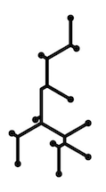

# Hypha IP Stack



Hypha IP is a tiny IP stack coded in C17/C23 which seeks to implement the _bare_ minimum of features to enable libudpard to operate in a resource constrained environment.

## Supported Features

* Single Network Interface
* Ethernet Multicast (`01:00:5E:xx:xx:xx`)
* IPv4, no optional headers
* IPv4 Checksum
* IPv4 Multicast
* UDP
* IGMPv2 (Join/Leave)

## Optional Features

* Software MAC Filter (incomplete)
* Software IP Filter (incomplete)
* Preloading ARP cache (incomplete)
* ARP Request/Response (incomplete)
* UDP Checksum (incomplete)
* ICMP Echo/Response (incomplete)
* VLAN Tagging (incomplete)

## User Requirements

Users will simply need to provide a set of functions with the following features:

* an Ethernet PHY driver capable of receiving raw frames and sending the frames which Hypha IP fills in. Hypha IP assumes that the CRC32 is handled by the Ethernet PHY Driver or Peripheral Hardware.
* A frame acquire and release mechanism. Users are free to use static or dynamic memory or DMA memory to implement this.
* A printing function to enable debugging. The lack of a printing function indicates that the debugging is disabled.
* A Monotonic Time source (in whatever granularity you wish).
* A reporting function which can receive asynchronous error reports.

## User Configurability

Users can statically configure Hypha IP in several regards

* IP TTL using `HYPHA_IP_TTL` set to a number > 0
* MTU Size using `HYPHA_IP_MTU` set to a number >= 64.
* ARP Cache (define `HYPHA_IP_USE_ARP_CACHE` as 1 or 0) and ARP Cache Size (`HYPHA_IP_ARP_TABLE_SIZE` set to a number > 0)
* IPv4 Checksum Enablement (`HYPHA_IP_USE_IP_CHECKSUM` set to `true` or `false`)
* UDP Checksum Enablement (`HYPHA_IP_USE_UDP_CHECKSUM` set to `true` or `false`)
* Ethernet MAC Filter (define `HYPHA_IP_USE_MAC_FILTER` to 1 or 0) and number of Filter Elements (`HYPHA_IP_MAC_FILTER_TABLE_SIZE` set to a number > 0)
* Allow any IP Localhost into the stack (define `HYPHA_IP_ALLOW_ANY_LOCALHOST` to 1 or 0)
* Allow any IP Broadcast into the stack (define `HYPHA_IP_ALLOW_ANY_BROADCAST` to 1 or 0)
* Allow any IP Multicast into the stack (define `HYPHA_IP_ALLOW_ANY_MULTICAST` to 1 or 0)
* Multicast IP Filter (define `HYPHA_IP_USE_IP_FILTER` to 1 or 0) and Number of Filter Elements (`HYPHA_IP_IPv4_FILTER_TABLE_SIZE` set to a number > 0)
* Use VLAN (define `HYPHA_IP_USE_VLAN` as 1 or 0) and assign VLAN ID using `HYPHA_IP_VLAN_ID` set to a number between 0 and 2^12-1 inclusive.
* Default expiration time for items to stay in the various Cache and Filters. Use `HYPHA_IP_EXPIRATION_TIME` which must be in the units of `HyphaIpTimestamp_t`.

## Building

```bash
cmake -B build -S .
cmake --build build --target all
```

### Testing

Using a host compiler, build

```bash
cmake -B build -S .
cmake --build build --target test
```

### Documentation

```bash
doxygen documentation/Doxyfile
open
```

## References

* <https://github.com/opencyphal/libudpard>
* <https://en.wikipedia.org/wiki/C23_(C_standard_revision)>
* <https://en.cppreference.com/w/c/language/generic>
* <https://en.wikipedia.org/wiki/IPv4>
* <https://en.wikipedia.org/wiki/Multicast_address>
* <https://en.wikipedia.org/wiki/User_Datagram_Protocol>

### Parent Forum post

* <https://forum.opencyphal.org/t/small-exemplar-network-stack/2383>
